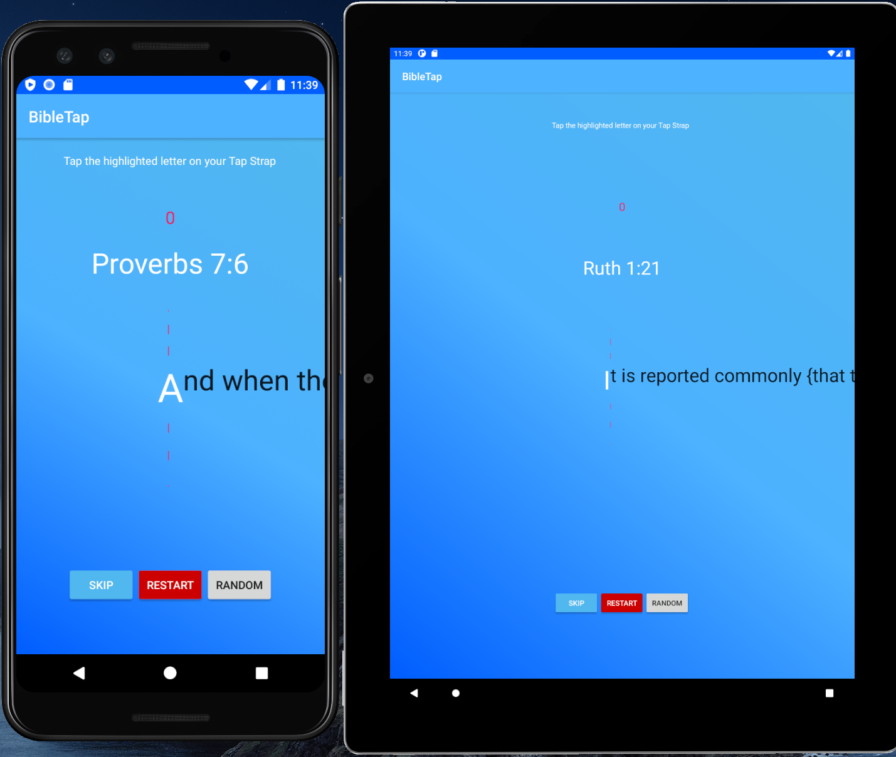

# Bible Tap
## Android App for typing training for the Tap Strap

App designed specifically for typing training on the Tap Strap 2.

  

App Screenshots:

  

The app combines audio (Bach's "Jesu, Joy of Man's Desiring") in order to build rhythm in typing tempo. With each character you are playing a note of the song. As your typing speeds up the song will speed up.
The song was chosen specifically for the fact that every note is of equal length (all are 8th notes) and is aimed at encouraging regularity and a smooth stable typing speed.

A counter keeps track of how many characters you successfully enter.

Currently the app is on an easier level where it auto-capitalises the letters for you.

Future todos:
- WPM counter
- Allow harder or easier difficulty by turning off auto capitalisation
- Allow sharing results

